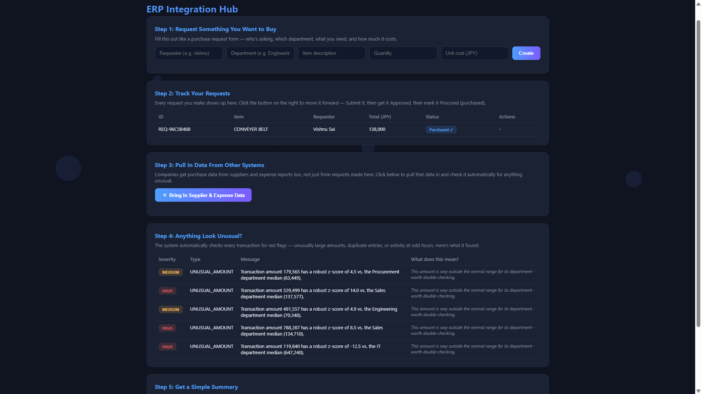
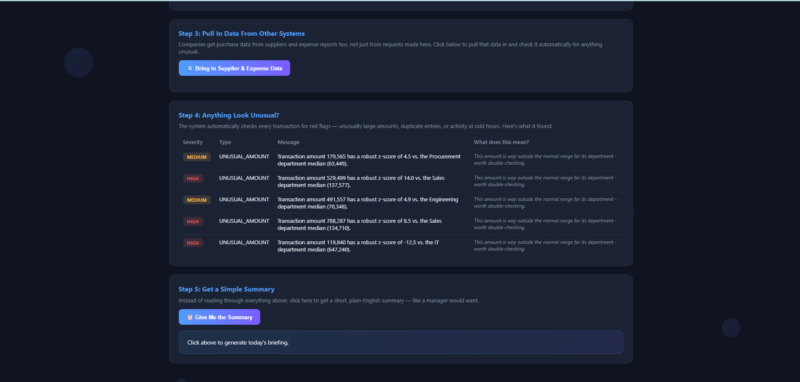
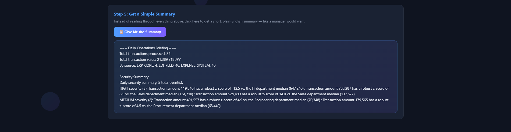

# ERP Integration Hub

A working slice of a Cloud ERP system — purchase requisition workflow with enforced business rules, data integration from simulated peripheral systems (EDI, expense reimbursement), automated security/anomaly monitoring, and a GenAI-powered daily operations briefing.

**Live demo:** https://erp-integration-hub-x4f1.onrender.com/
---

## Problem

Companies run on more than one system: an internal ERP core handles purchase approvals, while suppliers send order data via EDI feeds and employees submit expense claims through separate systems entirely. Each of these needs to be tracked consistently, checked for irregularities, and summarized for management — without someone manually cross-referencing spreadsheets from three different sources.

This project simulates that environment end-to-end: a real approval workflow with internal-controls rules, normalized data ingestion from multiple simulated sources, automated anomaly detection, and a plain-English summary layer.

## What it does

1. **Runs a real purchase requisition workflow** — Draft → Submit → Approve/Reject → Procure — with enforced business rules (a requester cannot approve their own requisition; large purchases require senior-level approval)
2. **Integrates data from peripheral systems** — simulates an EDI supplier feed and an expense-reimbursement feed, normalizing both into one consistent transaction format
3. **Monitors transactions for anomalies** using Median Absolute Deviation statistics (robust to outliers skewing their own baseline — a real issue found and fixed during development, not just theory), duplicate detection, and off-hours activity flagging
4. **Generates a plain-English daily briefing** summarizing transaction volume and flagged security events — grounded entirely in real retrieved data, never invented by the AI
5. **Exposes everything through a styled, non-technical dashboard** — anyone can create requisitions, move them through approval, sync external data, and review flagged events without touching an API directly

## Why Median Absolute Deviation, not standard z-score

Standard z-score anomaly detection has a real weakness on small datasets: a genuine outlier inflates its own standard deviation, which can hide it from detection instead of flagging it. This was discovered during testing — not assumed — when a deliberately planted large anomaly failed to trigger the original detector. Switching to MAD (which isn't dragged around by the outlier itself) fixed it, confirmed against the same test case.

## Architecture
erp_workflow.py → requisition -> approval -> procurement, with business rules
connectors.py → simulated EDI + expense system feeds, normalized to one format
security_monitor.py → MAD-based anomaly detection, duplicate detection, off-hours flagging
genai_assistant.py → plain-English daily briefing (retrieval-grounded, graceful fallback)
database.py → SQLite persistence
api.py + dashboard.py → FastAPI REST layer + styled web dashboard


## Screenshots

**Dashboard overview**


**Security events with plain-English explanations**


**Daily briefing**


## Tech stack

Python · FastAPI · SQLite · Anthropic API (optional, graceful fallback if no key set)

## Running locally

```bash
pip install -r requirements.txt
cd src
uvicorn api:app --reload
```
Then open `http://127.0.0.1:8000`

## Known limitations

- Peripheral system data (EDI, expense claims) is synthetically generated for demonstration — the connector layer is structured so real API/SFTP connectors could be substituted without touching downstream logic
- Requisition state is held in memory per running instance; a production deployment would persist workflow state fully in the database
- Cost estimates and anomaly thresholds are illustrative, not calibrated against real historical data
- Free-tier hosting (Render) spins down after inactivity, so the first request after idle time can take 30-50 seconds

